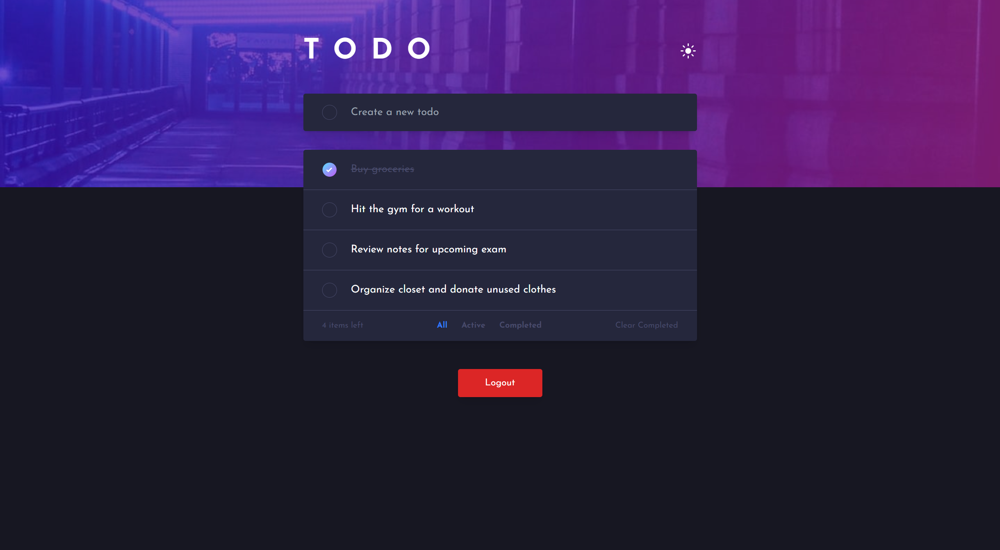

# Frontend Mentor - Todo app solution

This is a solution to the [Todo app challenge on Frontend Mentor](https://www.frontendmentor.io/challenges/todo-app-Su1_KokOW). Frontend Mentor challenges help you improve your coding skills by building realistic projects.

## Table of contents

- [Overview](#overview)
  - [The challenge](#the-challenge)
  - [Screenshot](#screenshot)
  - [Links](#links)
- [My process](#my-process)
  - [Built with](#built-with)
  - [What I learned](#what-i-learned)
- [Author](#author)

## Overview

### The challenge

Users should be able to:

- View the optimal layout for the app depending on their device's screen size
- See hover states for all interactive elements on the page
- Add new todos to the list
- Mark todos as complete
- Delete todos from the list
- Filter by all/active/complete todos
- Clear all completed todos
- Toggle light and dark mode
- **Bonus**: Drag and drop to reorder items on the list

### Screenshot



### Links

- Solution URL: [Add solution URL here](https://github.com/KH-Ray/todo-app)
- Live Site URL: [Add live site URL here](https://todo-app-be.fly.dev/)

## My process

### Built with

- Semantic HTML5 markup
- CSS custom properties
- Flexbox
- [React](https://reactjs.org/) - JS library
- [TypeScript](https://www.typescriptlang.org/) - JavaScript with syntax for types.
- [PostgreSQL](https://www.postgresql.org/) - Powerful, open source object-relational database
- [Sequelize](https://sequelize.org/) - Modern TypeScript and Node.js ORM

### What I learned

```ts
import bcrypt from 'bcrypt';
import { Todo, User } from '../models';
import { Router } from 'express';
import { v4 as uuidv4 } from 'uuid';
import { TodoRequestBody } from '../utils/types';

const router = Router();

router.get('/', async (_req, res) => {
  const users = await User.findAll({
    include: {
      model: Todo,
      attributes: ['id', 'content', 'marked'],
    },
  });

  res.status(200).json(users);
});

router.get('/:id', async (req, res) => {
  const user = await User.findOne({
    where: {
      id: req.params.id,
    },
    include: {
      model: Todo,
      attributes: ['id', 'content', 'marked'],
    },
  });

  res.status(200).json(user);
});

router.post('/', async (req, res) => {
  const { username, password } = req.body as TodoRequestBody;

  const passwordHash = await bcrypt.hash(password, 10);

  const user = await User.create({
    id: uuidv4(),
    username,
    passwordHash,
  });

  res.status(201).json(user);
});

router.delete('/:id', async (req, res) => {
  try {
    const user = await User.findOne({
      where: {
        id: req.params.id,
      },
    });

    if (!user) {
      throw new Error('Failed to delete user');
    }

    await user.destroy();
    res.status(204).end();
  } catch (error) {
    let errorMessage = 'Something went wrong.';
    if (error instanceof Error) {
      errorMessage += ' Error: ' + error.message;
    }
    res.status(400).send(errorMessage);
  }
});

export default router;
```

## Author

- Frontend Mentor - [@KH-Ray](https://www.frontendmentor.io/profile/KH-Ray)
